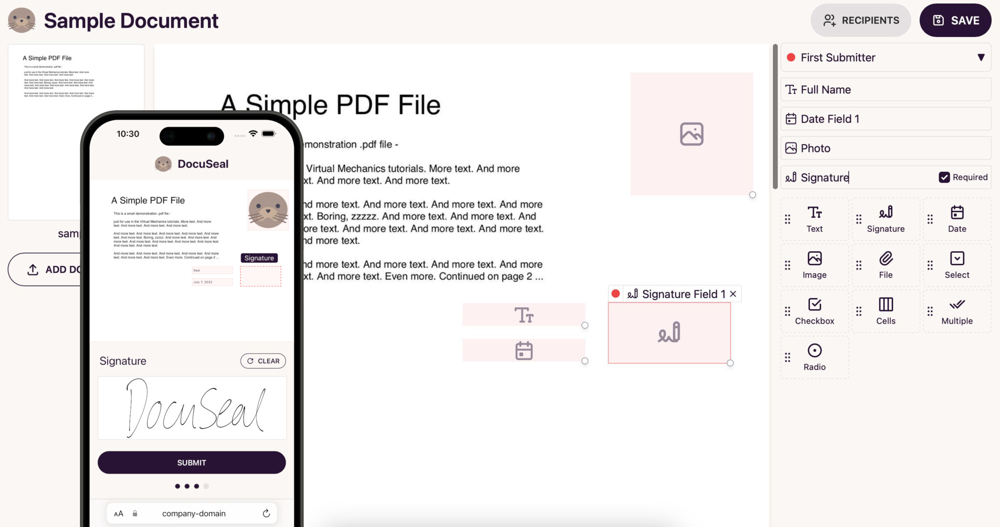

# DocuSeal CI/CD pipeline

Deploy DocuSeal server with CI/CD on Elestio

 
 

# Once deployed ...

You can open DocuSeal ADMIN UI here:

    URL: https://[CI_CD_DOMAIN]
    email: [ADMIN_EMAIL]
    password: [ADMIN_PASSWORD]

# SMTP

To configure the SMTP server, click on settings on the top right of the screen, then, click on Email on the left tab.

you can configure the SMTP server with the following credentials:

    Host: 172.17.0.1
    Port: 25
    Username: <space>
    Password: <space>
    Send from Email: [DOMAIN]@vm.elestio.app

# Custom domain instructions (IMPORTANT)

By default we setup a CNAME on elestio.app domain, but probably you will want to have your own domain.

**_Step1:_** add your domain in Elestio dashboard as explained here:

    https://docs.elest.io/books/security/page/custom-domain-and-automated-encryption-ssltls

**_Step2:_** update the env vars to indicate your custom domain
Open Elestio dashboard > Service overview > click on UPDATE CONFIG button > Env tab
there update `URL` & `DOMAIN` with your real domain
then, click on Update & Restart
